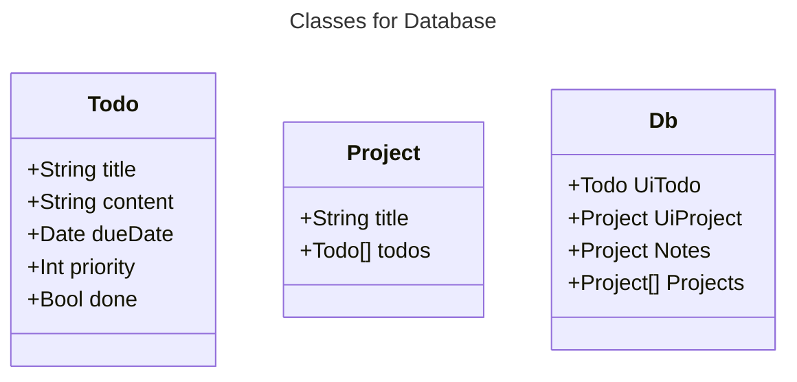
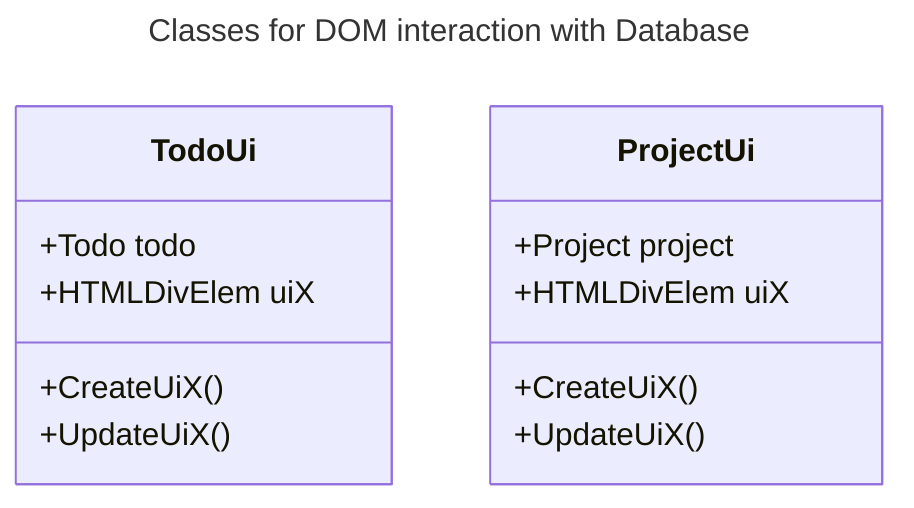

# odin-todolist
Todo List

## Live
https://cyprianespi.github.io/odin-todolist/

## Design
https://www.figma.com/file/29VLm2SFpiC27O4hey41fe/Todolist?type=design&node-id=0%3A1&mode=design&t=AL4k87jXoEmTH3pX-1

## Code architecture

